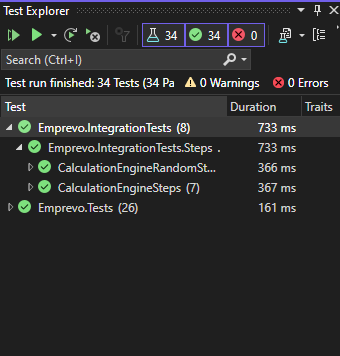

# Car Park Rate Calculator

This repository contains a car park rate calculation application with various parking rate scenarios. The application calculates parking fees based on entry and exit times and applies different rates such as Early Bird, Night Rate, Weekend Rate, and Standard Rate. The project also includes comprehensive unit tests and integration tests.

## Calculation Rules

- **Early Bird Rate**: Flat rate of $13.00 for entries between 6:00 AM to 9:00 AM and exits between 3:30 PM to 11:30 PM.
- **Night Rate**: Flat rate of $6.50 for entries between 6:00 PM to midnight (weekdays) and exits before 6:00 AM the following day.
- **Weekend Rate**: Flat rate of $10.00 for entries anytime from midnight on Friday to Sunday and exits before midnight on Sunday.
- **Standard Rate**: Hourly rate:
  - 0 – 1 hours: $5.00
  - 1 – 2 hours: $10.00
  - 2 – 3 hours: $15.00
  - 3+ hours: $20.00 flat rate for each calendar day of parking.

## Getting Started

### Prerequisites

- [.NET 8.0 SDK](https://dotnet.microsoft.com/en-us/download/dotnet/8.0)

### Installation

1. Clone the repository:
    ```bash
    git clone https://github.com/sajwil/carpark.git
    cd carpark
    ```

2. Build the solution:
    ```bash
    dotnet build
    ```

3. Run the application:
    ```bash
    dotnet run --project .\src\Emprevo.Api
    ```
4. Navigate to the Swagger UI:
``` [local_url]/swagger/index.html ```

5. Input the following parameters:
    ``` 
    {
        "entryDateTime": "2024-07-12T04:24:07.274Z",
        "exitDateTime": "2024-07-12T04:24:07.275Z"
    }
    ```

## Running Integration Tests

The project includes Gherkin-based test cases executed using xUnit.

1. Run `Emprevo.Api`
2. Copy the `URL` and replace it with value in `carpark\src\Emprevo.Api\appsettings.json`    
3. Run the tests using Test explorer:
    
4. Or via command line
    ```bash
    dotnet test .\src\Emprevo.IntegrationTests\Emprevo.IntegrationTests.csproj
    ```